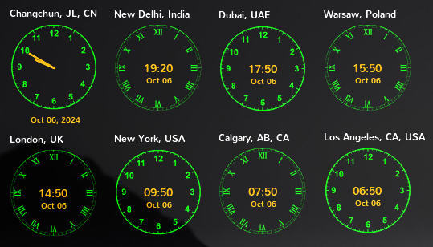

# README



## Overview

**Conky World Clock** initially started from a post on a [**PCLinuxOS Support Forum**](https://www.pclinuxos.com/forum/index.php/topic,162134.msg1402984.html#msg1402984).

Frankly, I would consider this a personal project. It still has ways to go to becoming available to GUI users.
***

## Quickstart
#### Download
```Plain&#x20;Text
git clone https://github.com/ArchieA/Conky-World-Clock
```

#### Running the widgets

In your terminal of choice:

```Plain&#x20;Text
conky ~/.conky-worldclock
```
This command, depending on your Desktop Environment, will launch the widget on the top left corner of your display.

